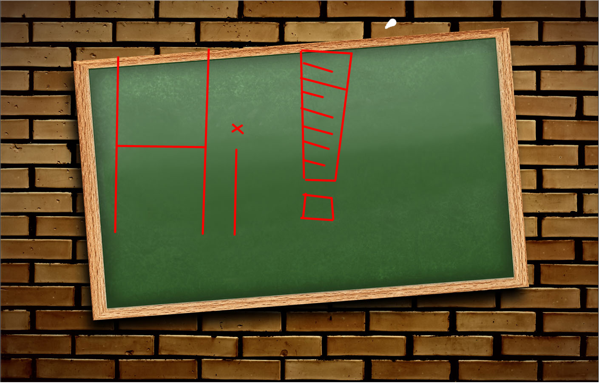

# [:octocat:White's Brain](https://github.com/TCCinTaiwan/White-Brain)

[](https://gitter.im/TCCinTaiwan/White-Brain?utm_source=badge&utm_medium=badge&utm_campaign=pr-badge) [](https://travis-ci.org/TCCinTaiwan/White-Brain)

## Table of Contents [↶]()
* **[Introduction](#introduction)**
* **[Demo](#demo)**
* **[Browser Support](#browser-support)**
* **[Installation](#installation)**
* **[Usage](#usage)**
* **[Todo](#todo)**
* **[Contributing](#contributing)**
* **[History](#history)**
* **[License](#license)**

## Introduction [↶]()
　　之前有一次在和同學解釋河內塔時，我使用了一個線上電子白板，但是操作起來覺得不夠直覺化，因此漸漸萌生自己做一個的念頭，這個專案也就在 KUAS ITC 的第一屆Hackathon開始執行了。

| [](https://www.python.org) |  |  |  |  |  |  |  |
| :---: | :---: | :---: | :---: | :---: | :---: | :---: | :---: |
| Python | Flask | HTML5 | CSS3 | JavaScript | Bootstrap | jQuery | Font Awesome |


## Demo [↶]()
[](http://tccintaiwan.asia/)
> [Live Demo!!](http://tccintaiwan.asia/).

## Browser Support [↶]()
|  |  |  |  |  |
| --- | --- | --- | --- | --- |
| IE 10+ ✖ | Chrome 4.0+ ✔ | Firefox 16.0+ ✖ | Opera 15.0+ ✖ | Safari 4.0+ ✖ |

## Installation [↶]()
```bash
# Clone the repository
git clone https://github.com/TCCinTaiwan/White-Brain
```

## Usage [↶]()
run Server:
```bash
# Go into the directory
cd White-Brain

# run server
python main.py
```

## Todo [↶]()
1. 工具
    - [ ] 選取框
    - [ ] 擦子
        + [ ] 物件擦
        + [ ] 區域擦
    - [ ] 畫線
        + [ ] 點 按一下
        + [X] 鉛筆
        + [X] 直線
        + [ ] 中心點模式
            * [ ] <kbd>Ctrl</kbd>
        + [ ] 曲線
            * [ ] <kbd>Alt</kbd>
            * [ ] <kbd>Shift</kbd>
    - [ ] 畫矩形/多邊形
        + [X] 矩形
        + [ ] 設定邊數
        + [ ] 正多邊形
            * [ ] <kbd>Shift</kbd>
        + [ ] 中心點模式
            * [ ] <kbd>Ctrl</kbd>
    - [ ] 畫圓形
        + [X] 正圓
            * [ ] <kbd>Shift</kbd>
        + [ ] 橢圓形
2. 物件
    - [ ] 文字
    - [ ] 圖片
3. 選項
    - [ ] 格線
        + [ ] 開啟關閉
            * [ ] <kbd>Ctrl</kbd> + <kbd>G</kbd>
    - [ ] 畫圖步驟物件化
    - [ ] 旋轉
        + [ ] 特殊角
            * [ ] <kbd>Ctrl</kbd>
4. 步驟
    - [ ] 上一步
        + [X] <kbd>Ctrl</kbd>+<kbd>Z</kbd>
        + [ ] 微調
    - [ ] 下一步
        + [X] <kbd>Ctrl</kbd> + <kbd>Y</kbd>
        + [ ] 微調
5. 小地圖
    - [ ] 預覽
6. 連線共用
7. 拖曳

## Contributing [↶]()
1. Create an issue and describe your idea
2. Fork it!
3. Create your feature branch: `git checkout -b my-new-feature`
4. Commit your changes: `git commit -m 'Add some feature'`
5. Push to the branch: `git push origin my-new-feature`
6. Submit a Pull Request

## History [↶]()
For detailed changelog, check [~~Change Log~~ ](CHANGELOG.md).

## License [↶]()
<a rel="license" href="http://creativecommons.org/licenses/by-sa/4.0/"></a>
<span xmlns:dct="http://purl.org/dc/terms/" property="dct:title">White's Brain</span>由<a xmlns:cc="http://creativecommons.org/ns#" href="https://github.com/TCCinTaiwan" property="cc:attributionName" rel="cc:attributionURL">TCC, chungtryhard</a>製作，以<a rel="license" href="http://creativecommons.org/licenses/by-sa/4.0/">創用CC 姓名標示-相同方式分享 4.0 國際 授權條款</a>釋出。
此作品衍生自<a xmlns:dct="http://purl.org/dc/terms/" href="https://github.com/TCCinTaiwan/White-Brain" rel="dct:source">https://github.com/TCCinTaiwan/White-Brain</a>。